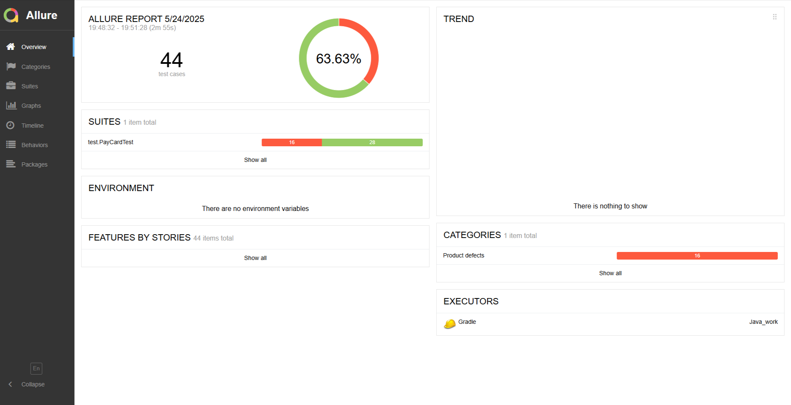

### Отчётные документы по итогам тестирования

#### Краткое описание

В ходе работы проведено тестирование сервиса покупки тура:
* Взаимодействие с банковским сервисом;
* При развертывании проекта, подключена СУБД MySQL;
* Обработка ответов банковских сервисов;
* Заполнение полей формы валидными/невалидными значениями;
* Кликабельность кнопок;
* Появление сообщений об успешной оплате;
* Появление сообщений об отклонении операции;
* Появление сообщений об ошибках при заполнении формы невалидными значениями;
* Проведена автоматизация тестов для покупки тура с помощью карты;


#### Количество тест-кейсов
* В ходе тестирования выполнено 44 тест-кейса
* Количество пройденных авто-тестов - 28 - 63,63%.
* Количество упавших авто-тестов - 16 - 36,36%
* По результатам тестов заведено 15 Issues.
  

### Общие рекомендации
* Необходима качественная техническая документация сервиса, в которой полностью определены требования к полям.
* Для упрощения реализации и поддерживания работы авто-тестов необходимо добавить в элементы страницы тестовые метки ```data-test-id = " * "```
* Исправить обнаруженные дефекты, с заведенными [Issues](https://github.com/AlexDedyaev/Course_work/issue)